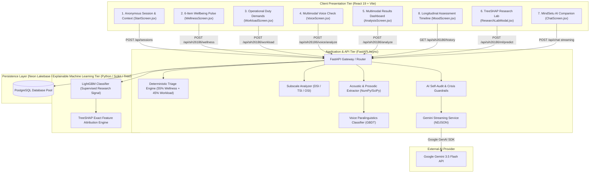

# MindSetu — Multimodal System Architecture & Design

This document details the end-to-end software, machine learning, and security architecture of **MindSetu**, an AI-assisted multimodal personnel welfare screening and decision-support platform designed for Smart India Hackathon 2026 Problem Statement **SIH26186**.

---

## 1. Multimodal System Topology



---

## 2. Multimodal Governance & Responsibility Boundaries

```text
┌────────────────────────────────────────────────────────────────────────────┐
│                       AI RESPONSIBILITY BOUNDARIES                         │
├──────────────────────────┬─────────────────────────────────────────────────┤
│ Tier                     │ Explicit System Responsibility                  │
├──────────────────────────┼─────────────────────────────────────────────────┤
│ 1. Deterministic Engine  │ Authoritative Welfare Triage & Risk Tiering     │
│ 2. Voice ML Classifier   │ Objective Paralinguistic Acoustic Biomarkers    │
│ 3. LightGBM Classifier   │ Supervised Research Signal & Pattern Discovery  │
│ 4. TreeSHAP Engine       │ Local & Global Feature Attribution (<15 ms)     │
│ 5. Google Gemini 3.5     │ Streaming Empathetic & Actionable Coping Chat   │
│ 6. Qualified Human       │ Actual Welfare Intervention & Medical Decisions │
└──────────────────────────┴─────────────────────────────────────────────────┘
```

---

## 3. Data Flow & Subscale Formulas

### 1. Self-Reported Subscales
- **Depression Symptom Indicator (DSI)**:
  $$\text{DSI} = \frac{Q1 (\text{Exhaustion}) + Q4 (\text{Cognitive Fog}) + Q6 (\text{Duty Burden})}{9} \times 100$$
- **PTSD / Trauma Symptom Indicator (TSI)**:
  $$\text{TSI} = \frac{Q2 (\text{Hypervigilance}) + Q3 (\text{Detachment}) + Q5 (\text{Trauma Intrusion})}{9} \times 100$$

### 2. Operational Workload Index (OSI)
Combines duty hours (25%), rest deficit (15%), night shifts (15%), leave gap (10%), intensity (20%), critical assignment (10%), and duty changes (5%) into a normalized score out of 100.

### 3. Voice ML Paralinguistic Signal
Extracts 24 acoustic/prosodic features (fundamental frequency pitch variability, hesitation/pause ratio, speech cadence, spectral flux, and 13 MFCCs) and computes an objective depressive strain probability score (0–100).

### 4. Deterministic Composite Triage Score
$$\text{Combined Score} = (0.55 \times \text{Wellness Score}) + (0.45 \times \text{Workload Score})$$

- **High Risk**: $\text{Combined} \ge 70 \lor \text{Wellness} \ge 80 \lor \text{Workload} \ge 85$
- **Moderate Risk**: $\text{Combined} \ge 45 \lor \text{Wellness} \ge 50 \lor \text{Workload} \ge 60$
- **Low Risk**: Otherwise.

---

## 4. Privacy & Zero-Audio Storage Guarantees

1. **In-Memory Waveform Processing**: Raw audio is decoded directly in memory buffers. Once acoustic features are extracted, the raw audio buffer is immediately released. Zero audio recordings are stored on disk or in the database.
2. **Anonymous UUID Sessions**: Sessions use cryptographically random UUIDv4 tokens with zero link to personnel rosters, defense IDs, or names.
3. **Deterministic Fallbacks**: If external AI services encounter rate limits or timeouts, the platform automatically serves pre-compiled deterministic coping recommendations without crashing.
