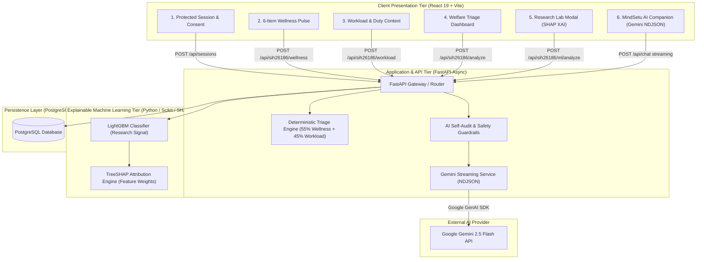

# MindSetu — System Architecture

This document describes the end-to-end software, machine learning, and safety architecture of **MindSetu**, an AI-assisted personnel welfare support prototype designed for Smart India Hackathon 2026 Problem Statement **SIH26186**.

---

## 1. System Topology & Component Layout



---

## 2. Dual-Layer AI Governance & Responsibility Boundaries

MindSetu enforces strict separation between statistical research signals, deterministic risk gating, and generative conversational support:

```
┌────────────────────────────────────────────────────────────────────────────┐
│                       AI RESPONSIBILITY BOUNDARIES                         │
├──────────────────────────┬─────────────────────────────────────────────────┤
│ Tier                     │ Explicit System Responsibility                  │
├──────────────────────────┼─────────────────────────────────────────────────┤
│ 1. Deterministic Engine  │ Authoritative Welfare Triage & Risk Tiering     │
│ 2. LightGBM Classifier   │ Research-Level Predictive Pattern Discovery     │
│ 3. TreeSHAP              │ Transparent Local & Global Feature Attribution  │
│ 4. Google Gemini         │ Contextual, Empathetic Supportive Communication │
│ 5. Qualified Human       │ Actual Welfare Intervention & Medical Decisions │
└──────────────────────────┴─────────────────────────────────────────────────┘
```

> [!IMPORTANT]
> - The **LightGBM research model** and **Gemini conversational model** never make diagnostic decisions or personnel disciplinary actions.
> - Triage risk bands (`Low`, `Moderate`, `High`) are calculated purely deterministically based on operational thresholds.

---

## 3. Data Flow & End-to-End Request Lifecycle

```text
[ Personnel Session ]
        │
        ▼
[ 1. Wellness Pulse ] ──────────► 6 Questions (0–3) ──► Normalized Wellness Score (0–100)
        │
        ▼
[ 2. Workload Context ] ────────► Duty Hours, Night Shifts, Leave Gap ──► Workload Score (0–100)
        │
        ▼
[ 3. Deterministic Triage ] ────► Combined Score = (0.55 × Wellness) + (0.45 × Workload)
        │                         ├─ High: Combined ≥ 70 OR Wellness ≥ 80 OR Workload ≥ 85
        │                         ├─ Moderate: Combined ≥ 45 OR Wellness ≥ 50 OR Workload ≥ 60
        │                         └─ Low: Otherwise
        ▼
[ 4. Research XAI (Optional) ] ─► LightGBM Model Inference + SHAP Waterfall Impact Values
        │
        ▼
[ 5. Gemini AI Companion ] ─────► Streaming NDJSON tokens with safety self-audit filters
        │
        ▼
[ 6. Emergency Safety ] ────────► Automatic Crisis Hotline Injection (Tele-MANAS / KIRAN)
```

---

## 4. Frontend Architecture (`React 19` + `Vite`)

- **Screen State Machine**: Managed centrally in `App.jsx`, preserving session objects across transitions without redundant network queries.
- **Design System Tokens (`components.css`)**:
  - HSL-tailored color palettes with high-contrast foregrounds (`--primary: #2563eb`, `--accent: #38bdf8`, dark mode background `--bg-surface: #0b1120`).
  - Fluid typography from Google Fonts (`Inter` / system-ui).
  - Responsive breakpoints down to 375px mobile viewports.
- **Accessibility & UX Guardrails**:
  - Full keyboard accessibility (<kbd>Tab</kbd> cycle, visible `:focus-visible` rings).
  - Screen-reader text (`.sr-only`) and ARIA live regions (`role="status" aria-live="polite"`).
  - `prefers-reduced-motion` compliance across all animations.

---

## 5. Backend Architecture (`FastAPI` + `PostgreSQL`)

- **Async Router Structure**:
  - `backend/main.py`: Base app, session lifecycle, mood check-ins, streaming chat endpoint `/api/chat`.
  - `backend/sih26186_server.py`: SIH26186 specific wellness, workload, and combined analysis endpoints.
  - `backend/sih26186_ml_routes.py`: ML model inference and SHAP explainability endpoints.
- **Streaming NDJSON Engine**:
  - Custom async generator yielding `start`, `token`, `fallback`, and `done` events.
  - 15-second total timeout window with automatic fallback injection if external LLM latency spikes.
- **PostgreSQL Database Schema**:
  - `sessions`: Anonymous UUIDs, role/unit metadata, created timestamp.
  - `wellness_checkins`: Normalized scores and individual pulse answers.
  - `workload_checkins`: Duty hours, night shifts, rest recovery, assignment stress.
  - `welfare_analyses`: Combined scores, risk bands, and recommended focus areas.
  - `mood_entries`: Longitudinal mood ratings and optional reflection notes.

---

## 6. Resilience & Safety Mechanisms

1. **Deterministic Supportive Fallback**: If Gemini encounters network failure, rate limiting, or malformed outputs, the streaming parser catches the exception and yields a structured fallback message without breaking the UI.
2. **AI Self-Audit Suite (`backend/tests/test_ai_self_audit.py`)**: Automated test cases verifying that AI responses never prescribe medications, provide clinical diagnoses, or suggest punitive personnel actions.
3. **Zero Secret Leakage**: All API keys (`GEMINI_API_KEY`, database credentials) reside exclusively in backend `.env` variables and are never bundled into the client build.
