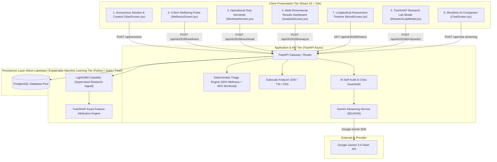

# MindSetu — System Architecture & Design

This document details the end-to-end software, machine learning, and security architecture of **MindSetu**, an AI-assisted personnel welfare screening and decision-support platform designed for Smart India Hackathon 2026 Problem Statement **SIH26186**.

---

## 1. System Topology & Component Layout



---

## 2. Four-Pillar Responsibility Governance

MindSetu enforces strict separation between statistical research signals, deterministic risk gating, and generative conversational support:

```text
┌────────────────────────────────────────────────────────────────────────────┐
│                       AI RESPONSIBILITY BOUNDARIES                         │
├──────────────────────────┬─────────────────────────────────────────────────┤
│ Tier                     │ Explicit System Responsibility                  │
├──────────────────────────┼─────────────────────────────────────────────────┤
│ 1. Deterministic Engine  │ Authoritative Welfare Triage & Risk Tiering     │
│ 2. LightGBM Classifier   │ Supervised Research Signal & Pattern Discovery  │
│ 3. TreeSHAP Engine       │ Local & Global Feature Attribution (<15 ms)     │
│ 4. Google Gemini 3.5     │ Streaming Empathetic & Actionable Coping Chat   │
│ 5. Qualified Human       │ Actual Welfare Intervention & Medical Decisions │
└──────────────────────────┴─────────────────────────────────────────────────┘
```

---

## 3. Data Flow & Subscale Formulas

### 1. Wellbeing Pulse & Subscales
- **Depression Symptom Indicator (DSI)**:
  $$\text{DSI} = \frac{Q1 (\text{Exhaustion}) + Q4 (\text{Cognitive Fog}) + Q6 (\text{Duty Burden})}{9} \times 100$$
- **PTSD / Trauma Symptom Indicator (TSI)**:
  $$\text{TSI} = \frac{Q2 (\text{Hypervigilance}) + Q3 (\text{Detachment}) + Q5 (\text{Trauma Intrusion})}{9} \times 100$$

### 2. Operational Workload Index (OSI)
Combines duty hours, night duties, rest deficit, leave gap, intensity rating, high-pressure assignment, and duty changes into a normalized score out of 100.

### 3. Composite Triage Score & Bands
$$\text{Combined Score} = (0.55 \times \text{Wellness Score}) + (0.45 \times \text{Workload Score})$$

- **High Risk**: $\text{Combined} \ge 70 \lor \text{Wellness} \ge 80 \lor \text{Workload} \ge 85$
- **Moderate Risk**: $\text{Combined} \ge 45 \lor \text{Wellness} \ge 50 \lor \text{Workload} \ge 60$
- **Low Risk**: Otherwise.

---

## 4. Resilience & Fallback Architecture

1. **AI Latency Budget**: Gemini calls are wrapped in an 8-second thread timeout with automatic fallback to pre-compiled deterministic coping recommendations.
2. **Database Pooling**: Connections are pooled using `psycopg_pool` to ensure zero connection leaks under burst traffic.
3. **Session Privacy**: Anonymous UUIDv4 tokens prevent cross-session correlation without storing any personal identifiers.
